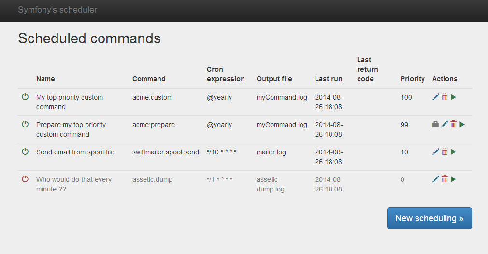
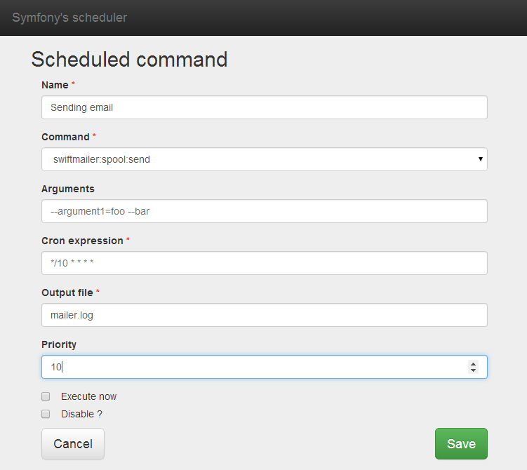
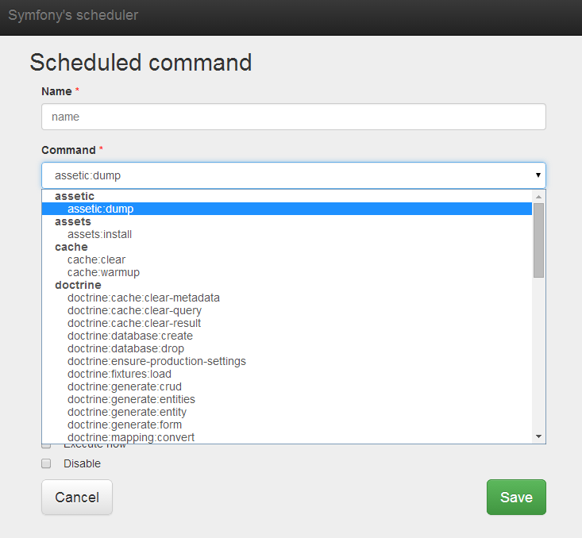

CommandSchedulerBundle
======================

This bundle will allow you to easily manage scheduling for Symfony's console commands (native or not) with cron expression.

**Version**: 1.2.7  

**Compatibility**:
 - **Symfony 2.8** and **3.x**
 - Tested with PHP 5.5, 5.6, 7.0, 7.1
 - Doctrine ORM

**If you use an older version of Symfony (2.3 to 2.7), use the last 1.1.x release**

## Features

- An admin interface to add, edit, enable/disable or delete scheduled commands.
- For each command, you define : 
 - name
 - symfony console command (choice based on native `list` command)
 - cron expression (see [Cron format](http://en.wikipedia.org/wiki/Cron#Format) for informations)
 - output file 
 - priority
- A new console command `scheduler:execute [--dump] [--no-output]` which will be the single entry point to all commands
- Management of queuing and prioritization between tasks 
- Locking system, to stop scheduling a command that has returned an error
- Monitoring with timeout or failed commands (Json URL and command with mailing)
- Translated in french, english, german and spanish

## Screenshots

## Documentation

See the [documentation here](Resources/doc/index.md).

## License

This bundle is under the MIT license. See the [complete license](Resources/meta/LICENCE) for info.
